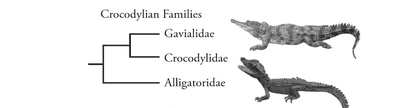
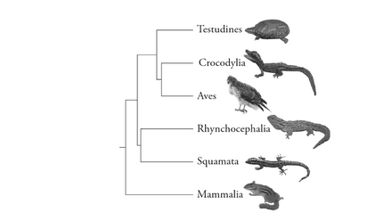

# Final Project - *Alligatoridae* Family

### Antonella Gonzalez

### Introduction

The *Alligatoridae* family is made up of species classified as alligators and caimans. Alligatoridae belongs to the order Crocodilia which is a sister taxa to birds(aves) and turtles(Testudines) due to the presence of the amniotic sac(2)(See Figures 1 and 2). All members of the Alligatoridae are carnivorous. Today the *Alligatoridae* family is distributed in Central and South America as well as the Southeastern United States (1). Their distinguished features such as massive skull and short, broad snout have not change significantly since the late Triassic. Members of *Alligatoridea* do not tolerate salt water, therefore their main way of dispersal was via land bridges. There is evidence that within *Alligatoridea* the caiman subclass evolved from the alligator subclass after its dispersal southward from North America to South America.

### Background on the DataSet
My original data file from the pbdb website contained occurence data for specimens in the alligatoridae family and when using the the shell command: 

		tail -n +19 alligatoridae_pbdb_data.csv | cut -d "," -f7 | sort | wc -l

 I can see that there are 444 specimens in the data. Specimens were identified to the family, genus or species rank within my dataset. Therefore, previous functions that I have written were to be able to sort through each occurence data and select only data which was identified to the species rank. For example, to create a species ranges dictionary I used the following python code:

		species_ranges=defaultdict(list)
		for line in alligator:
			items = line.split('","')
			min_ma = round(float(items[15]),3)
			max_ma = round(float(items[14]),3)
			species_name = items[9]
			if re.search(r"species", line):
				species_ranges[species_name].append(str(min_ma))
				species_ranges[species_name].append(str(max_ma))
Using this dictionary, I wrote a csv file that contained only the genus, species, min_ma and max_ma for specimens identified to the species rank:

		output=open("alligatoridae_ranges.csv", "w") #i am making the output file
		for key, values in species_ranges.items():
			values.sort()
			#the largest value appears last in list and smallest appears first in list
			max_age = values[-1]
			min_age = values[0]
			genus=key.split(" ")[0] 
			outline= "{},{},{},{}\n".format(genus, key, min_age, max_age)
			print(outline)
			output.write(outline)

Which looked like this:

Rstudio was used to label the data table:

Finally, using ggplot I created this rangeplot for species occurences.

### Future directions
It would be very interesting if the pbdb website provided data on the exact locations that each specimen was found in order to recreate species occurences map. When on the pbdb website however, I found a map which showed locations of the occurences already (it is linked below). We can see that some *Alligatoridae* specimens occurred in regions as far north as Canada. Clearly it is much to cold today in Canada at those high latitudes, therefore finding remains of members of this family either suggests that Canada once had a much warmer climate. This could be evidence supporting that tectonic plates and thus continents have shifted throughout earths history.

[*Alligatoridae* Occurence Map](/Figures/worldoccurence.png)

    1. "Natural History Collections: Family Alligatoridae." Natural History Collections: Family Alligatoridae. <http://www.nhc.ed.ac.uk/index.php?page=24.134.137.141.149>.

    2. Dodd, Kenneth C. Jr. "Reptile Ecology and Conservation: A Handbook of Techniques". (pg 4-6). https://books.google.com/books?id=pz8SDAAAQBAJ&pg=PA4&lpg=PA4&dq=alligatoridae+family+evolutionary+history&source=bl&ots=w-BJjh5AC9&sig=Uu8AP_TBYH-bTEc1K72kB8jTf6M&hl=en&sa=X&ved=0ahUKEwif5fH25LjSAhXFi1QKHYZnDlQQ6AEIVzAJ#v=onepage&q&f=false

    3. Rachel C. Benton, Dennis O. Terry, Jr., Emmett Evanoff, Hugh Gregory McDonald. "The White River Badlands: Geology and Paleontology". (pg 90-91). https://books.google.com/books?id=ZcFtCQAAQBAJ&pg=PA90&lpg=PA90&dq=alligatoridae+geologic+distribution&source=bl&ots=B13d3hQZJi&sig=3QzT9D4BGtffOaJEaj8ilpP8TQc&hl=en&sa=X&ved=0ahUKEwj0_aPa7bjSAhVI3mMKHcA4DQcQ6AEIRzAH#v=onepage&q=alligatoridae%20geologic%20distribution&f=false

