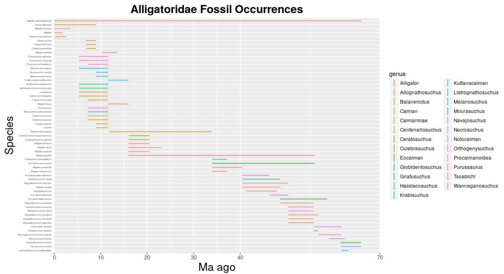
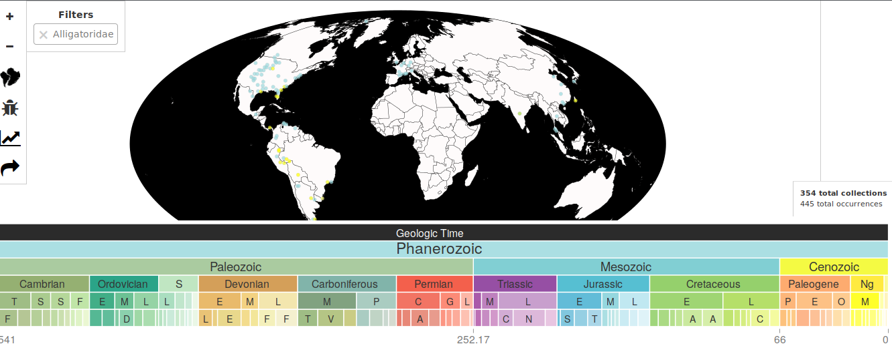

# Following Alligatoridae Family Species Diversity Through Time


## Abstract

## Introduction

The *Alligatoridae* family is made up of species classified as alligators and caimans. Alligatoridae belongs to the order Crocodilia which is a sister taxa to birds(aves) and turtles(Testudines) due to the presence of the amniotic sac [@Dodd_2016] (Figure \ref{Phylogeny1}) (Fig2). All members of the Alligatoridae are carnivorous. Today the *Alligatoridae* family is distributed in Central and South America as well as the Southeastern United States [@NHC]. Their distinguished features such as massive skull and short, broad snout have not change significantly since the late Triassic. Members of *Alligatoridea* do not tolerate salt water, therefore their main way of dispersal was via land bridges [@Benton_2015]. There is evidence that within *Alligatoridea* the caiman subclass evolved from the alligator subclass after its dispersal southward from North America to South America.

\begin{figure}[t]
\label{Phylogeny1}
\includegraphics[width=10cm, height=10cm,keepaspectratio]{Figures/alligatoridea-phylo2.png}
\end{figure}

\begin{figure}[t]
label{fig:pop2}
\begin{center}
\includegraphics[width=10cm, height=10cm,keepaspectratio]{Figures/figure2.png}
\end{center}
\end{figure}

\begin{figure}[t]
\label{fig:pop3}
\includegraphics[width=5cm, height=5cm,keepaspectratio]{Figures/fossil.png}
\end{figure}

\clearpage

## Methods

  In order to obtain data to analyze, I used the Paleobio Database that was shown in class. From here I searched for occurence data for the *Alligatoridae* family and found that my original data file from the pbdb website contained 444 specimens using the following shell command:
```{r, eval=FALSE}
		tail -n +19 alligatoridae_pbdb_data.csv | cut -d "," -f7 | sort | wc -l
```
  Specimens were identified to the family, genus or species rank within my dataset. Therefore, before I began to analyze the data, I sorted through each occurence and selected only data which was identified to the species rank. This allowed the creatation of a species ranges dictionary using the following python code:

```{r, eval=FALSE}
		species_ranges=defaultdict(list)
		for line in alligator:
			items = line.split('","')
			min_ma = round(float(items[15]),3)
			max_ma = round(float(items[14]),3)
			species_name = items[9]
			if re.search(r"species", line):
				species_ranges[species_name].append(str(min_ma))
				species_ranges[species_name].append(str(max_ma))
```				
  From this dictionary, I wrote a .csv file that contained only the genus, species, min_ma and max_ma for specimens identified to the species rank.

```{r, eval=FALSE}
		output=open("alligatoridae_ranges.csv", "w") #i am making the output file
		for key, values in species_ranges.items():
			values.sort()
			#the largest value appears last in list and smallest appears first in list
			max_age = values[-1]
			min_age = values[0]
			genus=key.split(" ")[0] 
			outline= "{},{},{},{}\n".format(genus, key, min_age, max_age)
			print(outline)
			output.write(outline)
```


  The "alligatoridae_ranges.csv" file was read into in Rstudio to first label the data with the appropriate labels then to create an occurrence through time plot using ggplot and forcats:
```{r, eval=FALSE}
library(ggplot2)
alligatoridae <- read.csv("/home/eeb177-student/Desktop/eeb177-final-project/alligatoridae_ranges.csv", header = F, as.is = T)
names(alligatoridae) <- c("genus", "species", "minage", "maxage")

library(forcats)
alligatoridae_occ <- ggplot(alligatoridae, aes(x = fct_reorder(species, minage, .desc = T), maxage, color=genus)) 
alligatoridae_occ + geom_linerange(aes(ymin = minage, ymax = maxage)) + coord_flip() + theme(axis.text.y = element_text(size=3)) + scale_y_continuous(limits=c(0, 70), expand=c(0,0), breaks=c(0, 10, 20, 30, 40, 70)) + labs(title = "Alligatoridae Fossil Occurrences", x = "Species", y = "Ma ago") + theme(plot.title = element_text(hjust = 0.5, size=20, face = "bold"), axis.title =element_text(size=20), axis.text.y = element_text(size=4), axis.text.x = element_text(size=10), axis.ticks.y=element_blank())
```
  Furthermore, using Pyrate a series of plots was constructed showing speciation, extinction rates for the extant species belonging to *Alligatoridae*. First the *Alligatoridae data was processed in R so that pyrate could be run. A total of 1,000,000 simulations were run to create the plots.
  
```{r, eval=FALSE}
source("~/PyRate/pyrate_utilities.r")
extant_alligatoridae = c("Alligator mississippiensis", "Alligator sinensis", "Caiman latirostris", "Caiman venezuelensis")
extract.ages.pbdb(file = "alligatoridae_occ.csv", extant_species = extant_alligatoridae)
```
\clearpage

## Results

  The Alligatoridae Fossil Occurence plot shows that we have fossil evidence showing that the *Alligatoridae* family has species that date almost to 70 million years into the past around the time of the Late Cretacious. Many of the species belonging to family *Alligatoridae* have since gone extinct except for the following species: Alligator mississippiensis, Alligator sinensis, Caiman latirostris, and Caiman venezuelensis. Of these, Alligator mississippiensis has been the longest surviving species as, according to this data, it has been in the fossil record since the oldest known *Alligatoridae* fossils nearly 70 million years old. 
  

\clearpage

The plots from running PyRate for 1,000,000 simulations show the speciation, extinction, net-diversification and longevity of the *Alligatoridae* species.
  


## Discussion

It would be very interesting if the pbdb website provided data on the exact locations that each specimen was found in order to recreate species occurences map. When on the pbdb website however, I found a map which showed locations of the occurences already (it is linked below). We can see that some *Alligatoridae* specimens occurred in regions as far north as Canada. Clearly it is much to cold today in Canada at those high latitudes, therefore finding remains of members of this family either suggests that Canada once had a much warmer climate. This could be evidence supporting that tectonic plates and thus continents have shifted throughout earths history.




## Github link
[link](https://github.com/antonella55/eeb177-final-project.git)

\clearpage

##References


