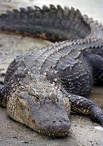

## Abstract

Since life's beginning on Earth, there has been the rise of many species; most of the once living species are no longer around anymore and there are few species which exibit great longevity. The *Alligatoridae* family of Crocodilians is one such family to whom long living species belong. Alligator mississippiensis is a species belonging to the *Alligatoridae* family and fossils representing this species have dated back greater than 60 million years ago; to the time of the Late Cretacious! While this famliy has one long-living species, through the exploration of its fossil occurence data, it can be seen just how much species diversity *Alligatoridae* has had through its existence. Posing larger questions of why is their one long-living species, as well as what drives the longevity of these species.

## Introduction

The *Alligatoridae* family is made up of species classified as alligators and caimans. *Alligatoridae* belongs to the order Crocodilia which is a sister taxa to birds(aves) and turtles(Testudines) sharing the common feature of an amniotic sac [@Dodd_2016] (Figures 2 and 3). All members of the Alligatoridae are carnivorous. Today the *Alligatoridae* family is distributed in Central and South America as well as the Southeastern United States [@NHC]. Their distinguishing features such as massive skull and short, broad snout have not change significantly since the late Triassic. Members of *Alligatoridea* do not tolerate salt water, therefore their main way of dispersal was via land bridges [@Benton_2015]. This has proved to be a factor limiting their dispersal abilities, perhaps influencing the ability of these species to be long-living. Although restricted in disperal due to salt water, the genus Alligator within the *Alligatoridae* family relatively more tolerant of cooler conditions and can survive farther from the equator than other members of the Crocodilia order possilby contributing to why fossils belonging to this family have been found as far north as Canada [@Benton_2015]. Moreover, there is evidence that within *Alligatoridea* the caiman genus evolved from the alligator subclass after its dispersal southward from North America and into South America. The appearance of the *Alligatoridae* family began and has continued to persist since the Late Cretaceous, continuing to survive through the death of the dinosaurs and Earth's glacial periods. In this study, the presence of species within the *Alligatoridae* famliy will be observed through time as well as viewing how rates of speciation and extinction have affected this family.
\clearpage

\begin{figure}[t]
\label{2}
\includegraphics[width=10cm, height=10cm,keepaspectratio]{Figures/alligatoridea-phylo2.png}
\centering
\caption{Phylogeny of Alligatoridae sister taxa}
\end{figure}
\begin{figure}[t]
\label{Phylogeny2}
\includegraphics[width=10cm, height=10cm,keepaspectratio]{Figures/figure2.png}
\centering
\caption{Phylogeny of Crocodilia sister taxa}
\end{figure}
\begin{figure}[t]
\label{fossil}
\includegraphics[width=5cm, height=5cm,keepaspectratio]{Figures/fossil.png}
\centering
\caption{Fossil belonging to Alligatoridae family}
\end{figure}
\clearpage

## Methods

The data used for this project was obtained from the Paleobio Database (PBDB) website shown during class. From the PBDB website, occurence data for the *Alligatoridae* family was collected into a csv file which was found to contain 444 specimens using the following shell command:
```{r, eval=FALSE}
		tail -n +19 alligatoridae_pbdb_data.csv | cut -d "," -f7 | sort | wc -l
```
  Specimens were identified to the family, genus or species rank within this dataset. Therefore, before beginning to analyze the data, each line of occurence data was sorted through using an "if" statement in the the python juptyr notebook. The "if" statement said that only if the data was identified to the species rank, then append it to the species ranges dictionary. The dictionary used the species name as the "key"" and all the min and max age values that corresponded to that species were made into a list which served as the corresponding "value" to the "key".
```{r, eval=FALSE}
		species_ranges=defaultdict(list)
		for line in alligator:
			items = line.split('","')
			min_ma = round(float(items[15]),3)
			max_ma = round(float(items[14]),3)
			species_name = items[9]
			if re.search(r"species", line):
				species_ranges[species_name].append(str(min_ma))
				species_ranges[species_name].append(str(max_ma))
```				
  From this dictionary, a "comma-separated values" file was written using the python jupyter notebook which formatted the csv file to list the genus, the species name, the min_age, and the max_age. An important step in retrieving the min and max ages was to sort the values which corresponded to each key, therefore the smallest age value would appear first in the "value" list at position 0 thus being the min_age of the species and the largest age value would appear last in the "value" list at the -1 position thus being the max_age of the species.

```{r, eval=FALSE}
		output=open("alligatoridae_ranges.csv", "w") #i am making the output file
		for key, values in species_ranges.items():
			values.sort()
			#the largest value appears last in list and smallest appears first in list
			max_age = values[-1]
			min_age = values[0]
			genus=key.split(" ")[0] 
			outline= "{},{},{},{}\n".format(genus, key, min_age, max_age)
			print(outline)
			output.write(outline)
```
\begin{figure}
\label{4}
\includegraphics[width=10cm, height=10cm,keepaspectratio]{Figures/alligdata.png}
\centering
\caption{Alligatoridae Ranges file}
\end{figure}


  The "alligatoridae_ranges.csv" file was read into in Rstudio to first label the data with the appropriate labels then to create an occurrence through time plot using ggplot. Forcats was used as well to order the data from most recent occurence to the oldest.
```{r, eval=FALSE}
library(ggplot2)
alligatoridae <- read.csv("/home/eeb177-student/Desktop/eeb177-final-project/alligatoridae_ranges.csv", header = F, as.is = T)
names(alligatoridae) <- c("genus", "species", "minage", "maxage")

library(forcats)
alligatoridae_occ <- ggplot(alligatoridae, aes(x = fct_reorder(species, minage, .desc = T), maxage, color=genus)) 
alligatoridae_occ + geom_linerange(aes(ymin = minage, ymax = maxage)) + coord_flip() + theme(axis.text.y = element_text(size=3)) + scale_y_continuous(limits=c(0, 70), expand=c(0,0), breaks=c(0, 10, 20, 30, 40, 70)) + labs(title = "Alligatoridae Fossil Occurrences", x = "Species", y = "Ma ago") + theme(plot.title = element_text(hjust = 0.5, size=20, face = "bold"), axis.title =element_text(size=20), axis.text.y = element_text(size=4), axis.text.x = element_text(size=10), axis.ticks.y=element_blank())
```
  Furthermore, using Pyrate a series of plots was constructed showing speciation, extinction, net diversification and longevity rates for the extant species belonging to *Alligatoridae*. First the *Alligatoridae data was processed in R so that pyrate could be run. A total of 1,000,000 simulations were run to create the plots.
  
```{r, eval=FALSE}
source("~/PyRate/pyrate_utilities.r")
extant_alligatoridae = c("Alligator mississippiensis", "Alligator sinensis", "Caiman latirostris", "Caiman venezuelensis")
extract.ages.pbdb(file = "alligatoridae_occ.csv", extant_species = extant_alligatoridae)
```
\clearpage

## Results

  The Alligatoridae Fossil Occurence plot shows that we have fossil evidence showing that the *Alligatoridae* family has species that date almost to 70 million years into the past around the time of the Late Cretacious(Figure 6). Many of the species belonging to family *Alligatoridae* have since gone extinct except for the following species: Alligator mississippiensis, Alligator sinensis, Caiman latirostris, and Caiman venezuelensis. Of these, Alligator mississippiensis has been the longest surviving species as, according to this data, it has been in the fossil record as the oldest *Alligatoridae* fossil recorded at nearly 70 million years old. 
  The plots from running PyRate for 1,000,000 simulations show the speciation, extinction, net-diversification and longevity of the *Alligatoridae* species. The first plot shown is the Speciation rate through time for the *Alligatoridae* family. At 1 million simulations run, it appears that the speciation rate was most likely to be about 0.085 and constant over the last 80 million years(Figure 7). This means that species belonging to the *Alligatoridae* family have evolved at a constant rate over time.
  The next plot done using PyRate is an Extinction curve for the *Alligatoridae* family(Figure 8). There is a visible trend for increasing extinction rate occuring through time. This could be a result of more species being around in general, resulting in more species around which at any time could suffer extinction. Although we do see that at present, only 4 extant species are represented in the fossil occurence data.
  The net diverisifcation through time plot shows that the peak diverisfication for *Alligatoridae* occurred early in its evolutionary history from about 80-65 million years ago (Figure 9). This is perhaps representative of shifting land masses and then the ice age?
  The final plot created using PyRate was the Longevity curve through time (Figure 10). This curve however does not completely agree with the *Alligatoridae* Fossil Occurences plot as it shows that the more ancient a species, the greater its longevity and this is not fully supported when viewing the occurence through time plot made using ggplot. The longevity curve shows that the more younger species had shorter longevity, this is expected as they have not been around long enough to rank high in longevity.
\clearpage

\begin{figure}
\label{4}
\includegraphics[width=20cm, height=20cm,keepaspectratio]{Figures/Alligatoridae-Occurence.png}
\centering
\caption{Alligatoridae Occurence Plot}
\end{figure}


\begin{figure}
\label{4}
\includegraphics[width=10cm, height=10cm,keepaspectratio]{Figures/Speciation.png}
\centering
\caption{Speciation}
\end{figure}

\begin{figure}
\label{4}
\includegraphics[width=10cm, height=10cm,keepaspectratio]{Figures/Extinction.png}
\centering
\caption{Extinction}
\end{figure}

\begin{figure}
\label{4}
\includegraphics[width=10cm, height=10cm,keepaspectratio]{Figures/Net-Diversification.png}
\centering
\caption{Net Diversification}
\end{figure}

\begin{figure}
\label{4}
\includegraphics[width=10cm, height=10cm,keepaspectratio]{Figures/Longevity}
\centering
\caption{Longevity}
\end{figure}

\clearpage

## Discussion

The results of this project have raised some interesting questions about the occurence and distribution of members of the *Alligatoridae* family since the Late Cretacious. From the PBDB webpage, a map showing where all the specimens were collected, in this case for those collected from the *Alligatoridae* family, is available to view (Figure 11). It can be seen that fossils found from this family are restricted to certain parts of the world, mainly North and South America. This supports the fact that these species are restricted in their distributions due to salt water. After viewing the Alligatoridae Occurence Plot made using ggplot, the question of why and how has the species Alligator mississippiensis had such great longevity, especially compared to the other *Alligatoridae* species. One possible reason may be that Alligator mississippiensis is native to North America, as noted by its name, and thus throughout the different climate cycles of Earth since the Late Cretaceous. At around the time of the Late Cretaceous, the sea level was much higher, thus posing a limitation to the migration of the species (Figure 12). However sea levels have mostly dropped since then, revealing more land thus perhaps aiding members of the *Alligatoridae* family to survive through the last ice age. 
 We can see that some *Alligatoridae* specimens occurred in regions as far north as Canada. Clearly it is much to cold today in Canada at those high latitudes, therefore finding remains of members of this family either suggests that Canada once had a much warmer climate. This could be evidence supporting that tectonic plates and thus continents have shifted throughout earths history.

\begin{figure}
\label{4}
\includegraphics[width=15cm, height=15cm,keepaspectratio]{Figures/worldoccurence.png}
\centering
\caption{PBDB World Occurence of Alligatoridae}
\end{figure}

\begin{figure}
\label{4}
\includegraphics[width=10cm, height=10cm,keepaspectratio]{Figures/cretaciousmap.png}
\centering
\caption{Cretacious Period World Map}
\end{figure}

###Github link https://github.com/antonella55/eeb177-final-project.git

\clearpage

##References


